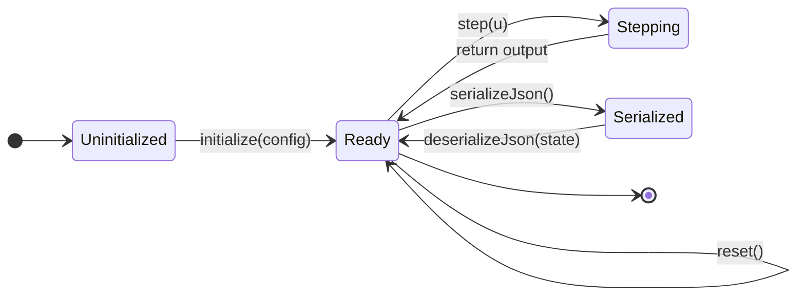

# DynamicElement — Unified Base Class for Dynamic Components

This document is the design authority for `DynamicElement` and `SisoElement` in
`liteaero::control`. It defines the lifecycle contract, the NVI pattern, and the logging
interface.

For the broader class hierarchy (Filter hierarchy, Propulsion, control sub-elements) and
the sim-side components that derive from these bases, see
[liteaero-sim/docs/architecture/dynamic_element.md](../../liteaero-sim/docs/architecture/dynamic_element.md).

---

## Motivation

The `DynamicElement` / `SisoElement` bases define the behavioral contract shared by all
stateful, time-evolving flight-software components: they maintain internal state, receive
time-stepped inputs, and produce time-correlated outputs. A unified root base class allows:

- Cross-cutting concerns (logging, telemetry, state snapshot) to be handled once
- Generic tooling (scenario replay, Monte-Carlo harness, snapshot comparison) to hold a
  heterogeneous collection of dynamic components through a common base pointer
- Both simulation and deployed flight software to share the same lifecycle contract

---

## `DynamicElement` Interface

```cpp
// include/liteaero/control/DynamicElement.hpp
#pragma once
#include <liteaero/log/ILogger.hpp>
#include <nlohmann/json.hpp>

namespace liteaero::control {

class DynamicElement {
public:
    virtual ~DynamicElement() = default;

    /// Parse parameters and configure internal structure from JSON config.
    /// Validates schema_version before forwarding to onInitialize().
    /// Must be called once before reset() or step().
    void initialize(const nlohmann::json& config);

    /// Restore element to initial post-initialize conditions.
    virtual void reset();

    /// Return a complete SI-unit JSON snapshot of internal state.
    /// Base injects "schema_version" and "type".
    [[nodiscard]] nlohmann::json serializeJson() const;

    /// Restore internal state from a snapshot produced by serializeJson().
    /// Validates schema_version before forwarding to onDeserializeJson().
    /// Throws std::runtime_error if schema_version does not match.
    void deserializeJson(const nlohmann::json& state);

    /// Attach a logger. Pass nullptr to detach.
    void attachLogger(liteaero::log::ILogger* logger) noexcept;

protected:
    virtual void           onInitialize(const nlohmann::json& config) = 0;
    virtual void           onReset()                                   = 0;
    virtual nlohmann::json onSerializeJson()                   const   = 0;
    virtual void           onDeserializeJson(const nlohmann::json&)    = 0;
    virtual void           onLog(liteaero::log::ILogger& /*logger*/) const {}
    virtual int            schemaVersion()                     const   = 0;
    virtual const char*    typeName()                          const   = 0;

    liteaero::log::ILogger* logger_ = nullptr;

private:
    void validateSchema(const nlohmann::json& state) const;
};

} // namespace liteaero::control
```

`initialize()` and `deserializeJson()` validate `"schema_version"` before forwarding to
the hook; they throw `std::runtime_error` on mismatch. `schemaVersion()` and `typeName()`
are pure-virtual so every concrete class is required to declare them explicitly. The base
injects both into every serialized snapshot so that diagnostic tools can identify and
version-check any snapshot without knowing the concrete type.

Proto serialization is not declared on this base because proto message types are
component-specific. Each concrete class declares `serializeProto()` /
`deserializeProto()` with the appropriate message type.

---

## `SisoElement`

`SisoElement` is the abstract base for all single-input, single-output dynamic elements.
It derives from `DynamicElement` and adds the SISO step interface.

```cpp
// include/liteaero/control/SisoElement.hpp
namespace liteaero::control {

class SisoElement : public DynamicElement {
public:
    [[nodiscard]] float in()  const { return in_; }
    [[nodiscard]] float out() const { return out_; }
    operator float()          const { return out_; }

    /// NVI entry point — records in_/out_, calls onStep(), then calls onLog()
    /// if a logger is attached.
    virtual float step(float u);

    /// Zeros in_/out_, then calls onReset().
    void reset() override;

protected:
    float in_  = 0.0f;
    float out_ = 0.0f;

    virtual float onStep(float u) = 0;
    void onReset() override {}
};

} // namespace liteaero::control
```

The public `step(float u)` is the NVI entry point: it records `in_` and `out_`, calls
`onStep()` for the subclass-defined update, then calls `onLog()` if a logger is attached.
`reset()` zeros `in_` and `out_` before calling `onReset()`.

---

## Component Lifecycle



| Method | Responsibility |
| --- | --- |
| `initialize(config)` | Parse parameters, allocate resources, configure internal structure |
| `reset()` | Return to initial post-initialize conditions; called between simulation runs |
| `step(u)` | Advance one timestep; record `in_`/`out_`; call `onStep()`; call `onLog()` |
| `serializeJson()` | Return a complete SI-unit JSON snapshot of internal state |
| `deserializeJson(state)` | Restore internal state from a snapshot |

---

## Serialization Contract

Every `DynamicElement` subclass serializes a complete, self-describing JSON snapshot.

| Rule | Detail |
| --- | --- |
| All values in SI units | `"wn_rad_s"` not `"wn_hz"`; `"dt_s"` not `"dt_ms"` |
| Field names encode units | `"altitude_m"`, `"roll_rate_rad_s"`, `"thrust_n"` |
| `schema_version` always present | Integer; base class injects it; `onSerializeJson()` must not duplicate it |
| `type` always present | String from `typeName()`; base class injects it; `onSerializeJson()` must not duplicate it |
| Round-trip lossless | `deserializeJson(serializeJson())` must yield identical state |
| Schema version checked on load | Base class validates; throws `std::runtime_error` on mismatch |

### Example snapshot

```json
{
    "schema_version": 1,
    "type": "FilterSS2",
    "in": 0.0,
    "out": 0.0,
    "state": { "x0": 0.0, "x1": 0.0 },
    "params": {
        "design":    "low_pass_second",
        "dt_s":      0.01,
        "wn_rad_s":  6.2832,
        "zeta":      0.7071,
        "tau_zero_s": 0.0
    }
}
```

---

## Logging Interface

Logging is injected via a pointer to `liteaero::log::ILogger`. The base calls `onLog()`
at the end of every `step()` when a logger is attached. Elements are not required to
implement `onLog()` — the default is a no-op.

```cpp
// include/liteaero/log/ILogger.hpp
namespace liteaero::log {

class ILogger {
public:
    virtual ~ILogger() = default;
    virtual void log(std::string_view channel, float value_si) = 0;
    virtual void log(std::string_view channel, const nlohmann::json& snapshot) = 0;
};

} // namespace liteaero::log
```

Loggers are attached at scenario setup time, not in constructors.

---

## Schema Version Convention

Each concrete class supplies its own `kSchemaVersion_` constant and implements
`schemaVersion()` to return it. Schema version is always `1` during initial development;
it will be incremented when fields change after the project transitions to a maintenance
phase.

---

## Files

| File | Contents |
| --- | --- |
| `include/liteaero/control/DynamicElement.hpp` | Root abstract base |
| `src/control/DynamicElement.cpp` | `initialize`, `reset`, `serializeJson`, `deserializeJson`, `attachLogger` |
| `include/liteaero/control/SisoElement.hpp` | SISO NVI wrapper over `DynamicElement` |
| `src/control/SisoElement.cpp` | `step`, `reset` |
